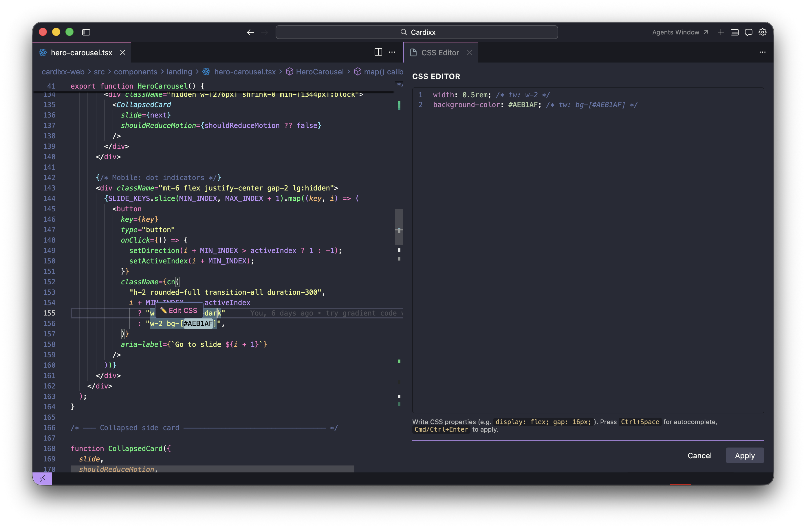
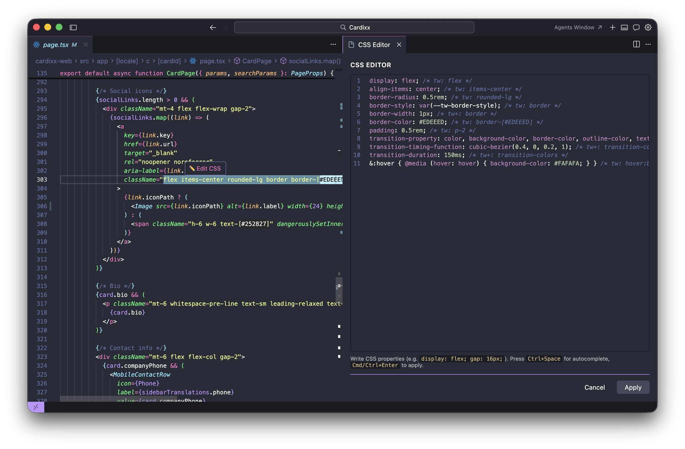

  

# Tailwind CSS Lens

Inspect and edit Tailwind utility classes as plain CSS in an interactive CodeLens-powered editor. Click a class attribute, tweak the CSS, and apply — your Tailwind classes update automatically.

## Screenshots

  

  

## Features

- **Hover to edit** — Hover over any class string inside `className` or `class` attributes to open the CSS editor, works with static strings and individual strings inside dynamic expressions like `cn()`, `clsx()`, and ternaries
- **Real CSS editor** — Full CodeMirror 6 editor with syntax highlighting and autocomplete
- **Tailwind CSS v4 engine** — Uses the real Tailwind compiler for pixel-perfect CSS output
- **Bidirectional conversion** — Edit CSS and get Tailwind classes back; classes you didn't touch are preserved exactly
- **Variant support** — Responsive (`lg:hidden`), state (`hover:underline`), dark mode, and stacked variants rendered as real CSS blocks

## Usage

1. Open a file containing `className` or `class` attributes (JSX, TSX, HTML, Vue)
2. Hover over a class string — click **Edit CSS** in the hover popup
3. A CSS editor opens showing the current Tailwind classes as plain CSS
4. Edit the CSS — change values, add new properties, or remove lines
5. Click **Apply** to convert back to Tailwind classes

## Supported Languages

- JavaScript React (JSX)
- TypeScript React (TSX)
- HTML
- Vue

## Configuration

| Setting | Default | Description |
|---------|---------|-------------|
| `cssTailwind.tailwindConfigPath` | `""` | Path to a custom `tailwind.config.js` |

## License

[MIT](LICENSE)
